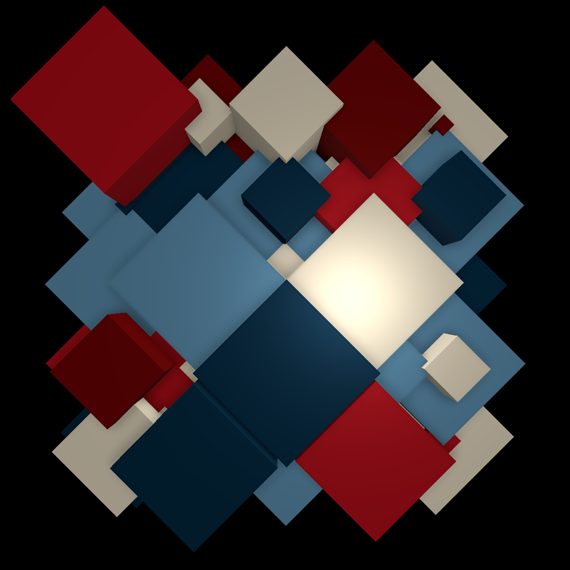

# Creative Coding with Three.js: Grids!

Follow the creative coding process as we block out a Joshua-Davis-style grid in Three.js, swap bold color palettes, and drop in GTAO for beautiful depth — let's see what surprises emerge. It’s iterative, playful, and full of unexpected successes that you can remix into your own.

Inspiration: 
https://joshuadavis.com/ / https://github.com/hype/HYPE_Processing


**Learn Three.js Basics Course**
https://robotbobby.thinkific.com/courses/learn-threejs-basics

Please consider supporting me over on Patreon: patreon.com/RobotBobby




## Usage
Run a local server to serve the project:

```sh
npx http-server
```
or fire up Live Server

Then open `http://localhost:8080` (or the appropriate URL) in your browser.


## Dependencies
- [Three.js](https://threejs.org/) (WebGPU Renderer, Orbit Controls)
- Node.js (optional, for serving files locally)

## Development
Modify `index.js` to experiment with different Three.js objects, materials, or effects.

## License
This project is licensed under the MIT License. Feel free to modify and distribute.

